Introduction
============

##### 

This manual describes the Wizard2011 for BiBiServ2 tool descriptions. The purpose of the Wizard is to enable tool developers to deploy their applicatons onto the BiBiServ without having to understand BiBiServ mechanics all too well.

##### 

Our motivation for programming a Wizard for BiBiServ 2 is the experience made with tool development processes for the original BiBiServ (BiBiWS architecture by Henning Mersch [1]): Tool Developers had to understand the whole WebService Server- and Client-architecture of the BiBiServ and had to code the web user interface for their tool manually based on a template. Integration and deployment of new tools onto the BiBiServ took a long time and was a barrier for tool developers who were not necessarily familiar with web development or server structure.

##### 

The Wizard does not require developers to have extensive web technology knowledge. Basic html skills in addition to expertise on their own tool should be enough to create a full-blown web user interface that can be directly deployed onto the BiBiServ.

##### 

In addition to this main target audience the Wizard also enables experienced BiBiServ users to extend existing tool descriptions, validate Dependencies, create valid micro- and miniHTML descriptions, etc.

##### 

This manual starts with a quick guide to create your first tool description (chapter [quickstart]). New users of the wizard should probably start there. In the next chapter we describe the wizards general layout and the purpose of its design (chapter [layout]). In chapter [single-pages] we discuss every page in the Wizard in more detail to answer any specific question you might have while describing your tool using the Wizard. The chapter about formats and standards gives experienced users a more thorough understanding of the tool descriptions they are creating and should enable you to find solutions to any complex problems that might occur (chapter [standards]). After describing a tool you can use the create XML page (section [create-xml]) to export your description as .bs2 or even as source code for a BiBiServ web interface. Those output options are described in the next chapter (chapter [output]). Finally this manual contains additional information for the administration of the Wizard (chapter [admin]).

Your first Tool Description Step by Step
========================================

##### 

In this chapter we will guide you through the creation of a first rudimentary tool description.

The Overview Page
-----------------

[quickstart-overview]

##### 

Your first impression of the wizard is the overview page. From here you can access any module of the Wizard (see also: [layout-overview]). You should start your first tool description by providing basic information about your tool by clicking the pen next to the “Basic Information” label (see figure [quickstart-overview]).

Basic Information
-----------------

[quickstart-basicinfo]

##### 

You can now type in the most general data about your tool: What is its name (the “name”-text-field) and what does it do (the “short description”-text-field). You can see example input in figure [quickstart-basicinfo].

[quickstart-editor]

##### 

By clicking the “Open Text Editor”-button next to the “Description” label you can access the microHTML-editor (see figure [quickstart-editor]). Here you should describe what your tool does in more detail. You may use rudimentary html here (the permitted parts of html are described in more detail in section [microhtml]). After finishing your description text please confirm your input using the “Save and return” button. This should lead you back to the Basic Information page (figure [quickstart-basicinfo]). Please click “Save and return” again. Now you should be back at the overview page.

Executable Information
----------------------

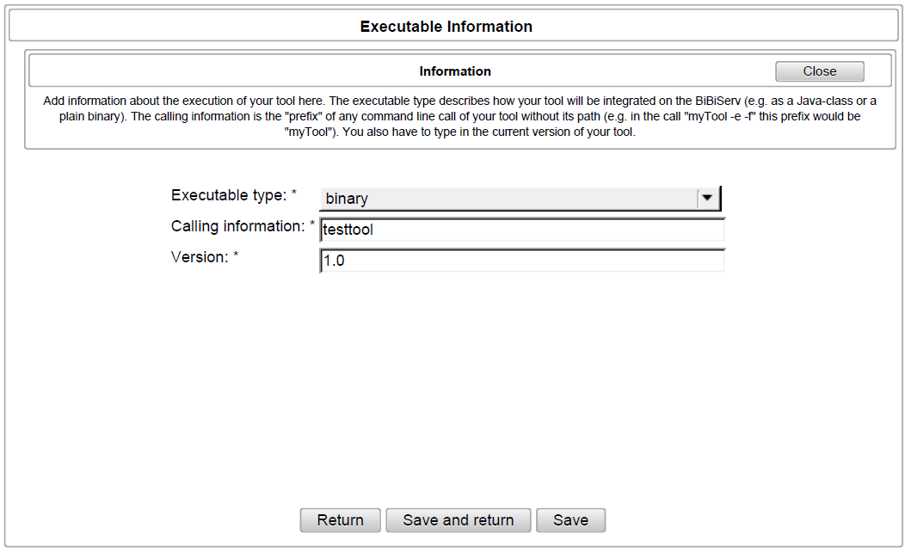

[quickstart-execinfo]

##### 

Next you should click the pen next to the “Executable Information” label. At this page (see figure [quickstart-execinfo]) you have to provide information about your tools execution on the BiBiServ.

##### 

The **executable type** describes which kind of application you intend to upload onto the BiBiServ (in most cases this is a compiled binary). The **calling information** is the commandline command for your tool (in most cases this is just the tools name). Finally you have to type in your tools **version**.

##### 

Please confirm your input by clicking the “Save and return”-button.

Authors
-------

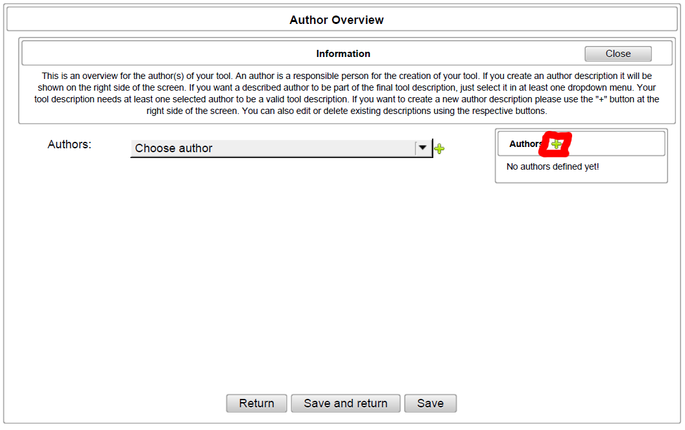

[quickstart-authorSelection1]

##### 

Now you should go to the “Author Overview” page to provide information about your tools author(s). To create a new author description, please click the “+” next to the “Authors” label on the right side of the screen (see figure [quickstart-authorSelection1]).

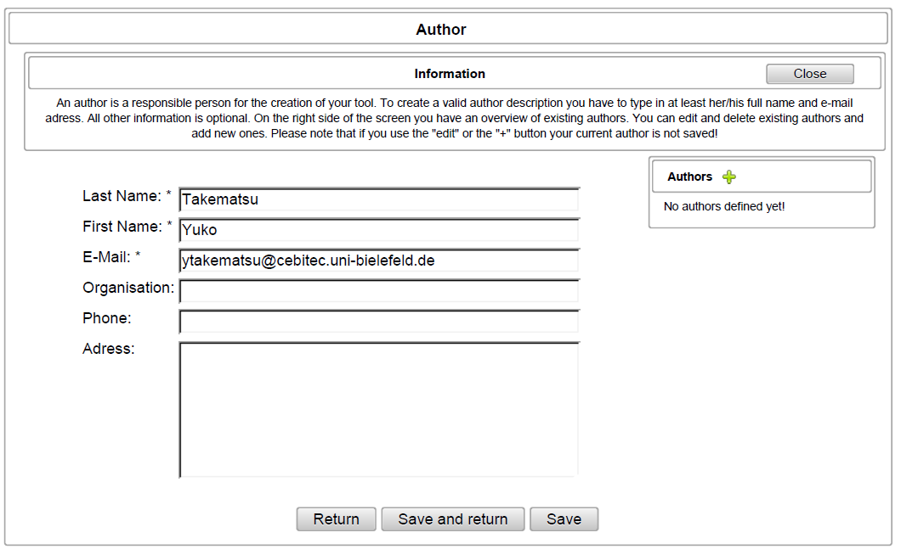

[quickstart-author]

##### 

Please enter the authors first name, last name and e-mail-adress and confirm your input by clicking “Save and return” (like in figure [quickstart-author]).

##### 

You should notice now that the author overview page has changed slightly: At the box of the right side of the screen you can see the author you just described. Please select this author at the dropdown menu at the center of the screen and confirm your input by clicking “Save and return” (like in figure [quickstart-authorSelection2]).

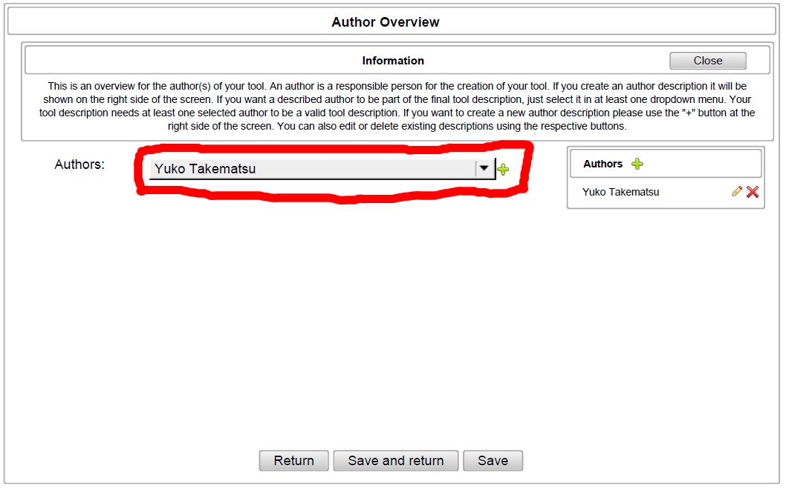

[quickstart-authorSelection2]

Functions
---------

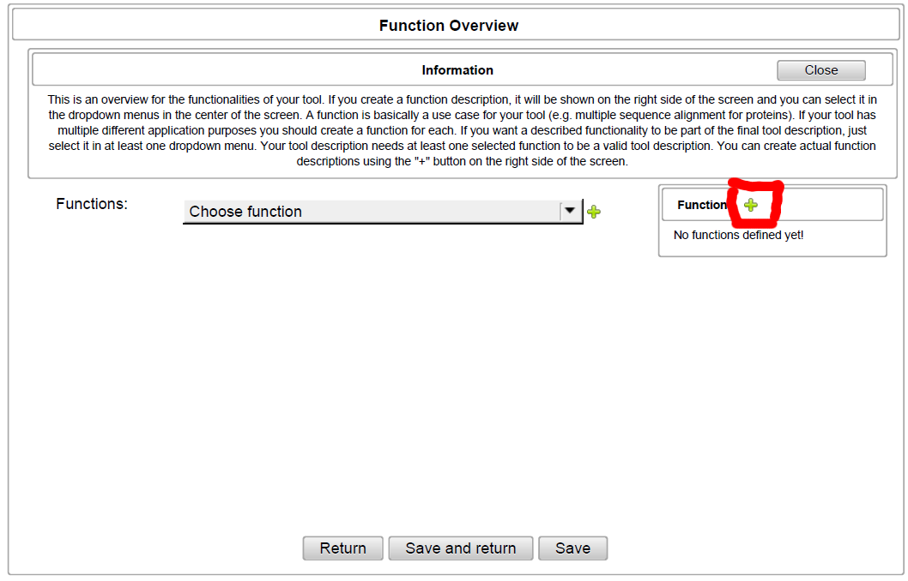

[quickstart-functionSelection1]

##### 

The next step is the “Function Overview” page. Here you can describe what your tool actually does. A function(ality) is the description for one particular use case of your function. Complex tools might have multiple functionalities (e.g. structure prediction for DNA (function 1) *and* RNA (function 2)). To create a new function description, please click the “+” next to the “Functions” label on the right side of the screen (see figure [quickstart-functionSelection1]).

[quickstart-function1]

##### 

This new page might seem overwhelming at first, but we will take it step by step. You can find a more thorough explanation of the pages elements in section [function].

##### 

At first you should enter a name and a short description of this functionality. Then please click the “+” next to the “Outputs” label on the right side of the screen (see figure [quickstart-function1]).

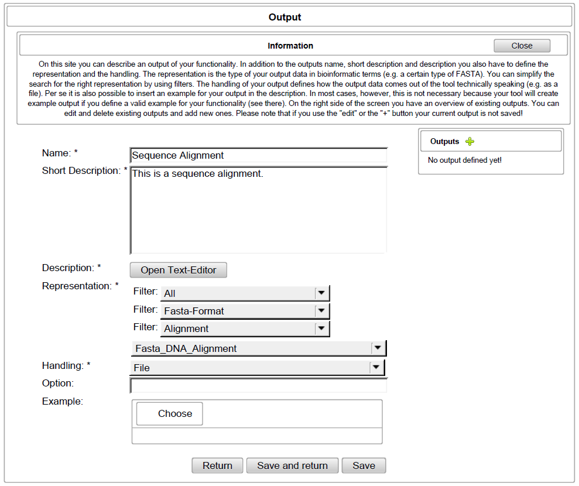

[quickstart-output]

##### 

Your description of an output should include a name, a short description, a representation and the outputs handling. The outputs **representation** is the bioinformatics format of your tools output (e.g. FASTA DNA). You can use filters to simplify your search for the right representation. You can find a more thorough explanation of representations in section [representations]. The outputs **handling** describes how your tool returns its output (your tool could write the output into a file for example, which would be a “FILE” handling). If you are finished please confirm your input by clicking “Save and return” (like in figure [quickstart-output]).

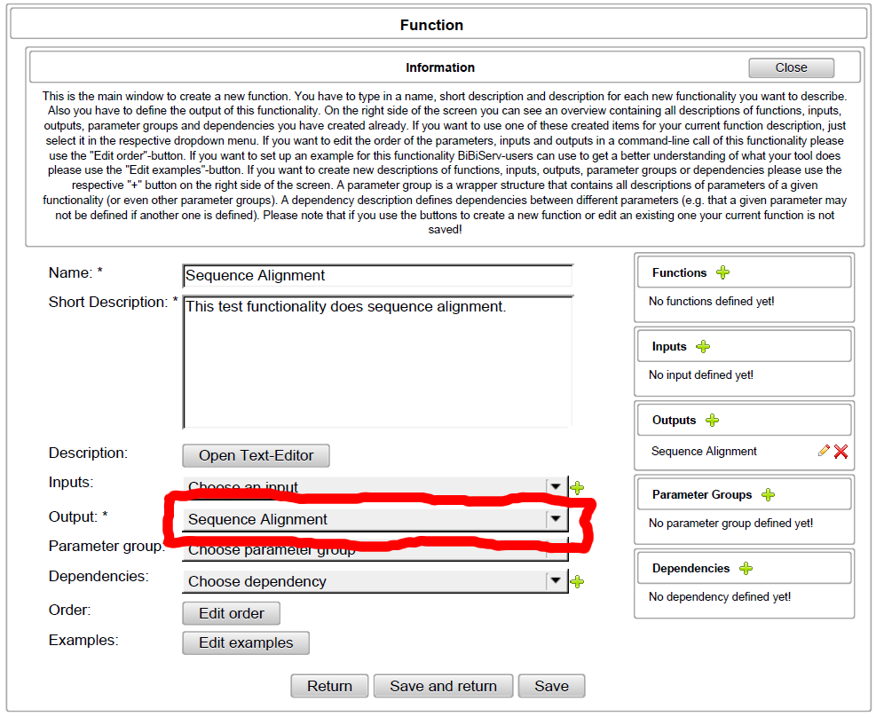

[quickstart-function2]

##### 

You should now be able to select your newly created output in the respective dropdown menu (like in figure [quickstart-function2]). Please do so and click “Save and return”.

[quickstart-functionSelection2]

##### 

Please select your newly created function now in the dropdown menu at the center of the screen (like in figure [quickstart-functionSelection2]) and click “Save and return”.

Manual
------

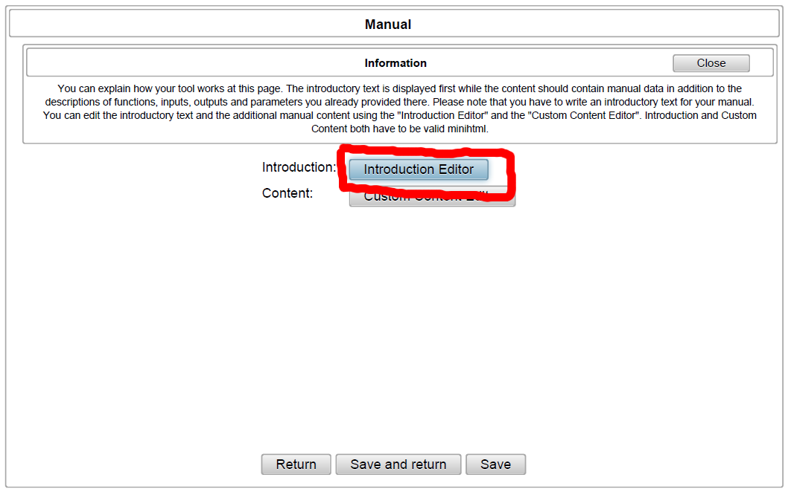

[quickstart-manual]

##### 

The last mandatory part of a valid tool description is the manual. Most of the manual is generated automatically out of our functionality description. However you have to provide an introductory text for your manual here (see figure [quickstart-manual]).

##### 

The introductory text is edited in an editor like the Description content before. You are allowed to use more html tags here though (this is described in more detail in section [minihtml]). As soon as you are finished please confirm your input by clicking the “Save and return”-button until you are back at the overview page.

Saving your Description
-----------------------

[quickstart-createXML1]

[quickstart-createXML2]

##### 

The final step is to save your tool description. The description is saved as an XML document in .bs2 format (for a more thorough explanation of this format please read section [bibiservabstraction]). To create such an XML document please click the “Create XML”-button at the bottom of the overview page.

##### 

At the “create XML” page itself you should now click the “create XML” button at the center of the screen (see figure [quickstart-createXML1]). The Wizard will now insert all of your input into a XML document. You can download this document by clicking the “Download” button (see figure [quickstart-createXML2]).

##### 

And there you have it! Your first tool description done in the Wizard 2011. If you want to flesh out your description later you can load your description file again. This is explained in section [load-xml].

Wizard Layout
=============

##### 

In this chapter we discuss the Wizards general layout. This chapter does not contain information on the of any page (the functionality is described in chapter [single-pages]). Here we explain the general idea behind the visual design of the Wizard.

Buttons and Visual Elements
---------------------------

clX **Figure** & **Name** & **Description**
 & Add new Element & By clicking this button you can create a new element of a given type, either a dropdown menu or content. If you create new content a new page with all relevant edit options will open.
[0.1cm] & Edit Element & By clicking this button you can edit the existing element beside the button. A new page with all relevant edit options will open.
[0.1cm] & Remove Element & By clicking this button you can remove the existing element beside this button, either a dropdown menu or content.
[0.1cm] & Copy Element & By clicking this button you can copy the existing element beside the button. A new page with all relevant edit options will open.
[0.1cm] & Traffic lights & Traffic lights visualize the status of a given description. If the light is red your current working state is not valid and you won’t be able to export it as a .bs2. If the light is yellow the provided information about your tool is valid but not very detailed. If the traffic light is green your tool description is optimal.
[0.1cm]

Overview Page
-------------

##### 

This is the general overview for the creation of your new tool description. You can easily see the current state of creation here. The traffic lights beside the categories represent how close your description is to completion (see section [visual-elements]).

##### 

To start a tool description you should start from the top to the bottom beginning with “Basic Information” (see section [basicInfo]).

##### 

If you want to load an existing (valid!) tool description, please use the “Load XML”-button (see [load-xml]). If you want to save your current state of work as an xml-tool description please use the “create XML”-button (see [create-xml]; this will not work if there are red traffic lights left!). If you want to delete your current work and start over again please use the “clear”-button.

Selection Pages
---------------

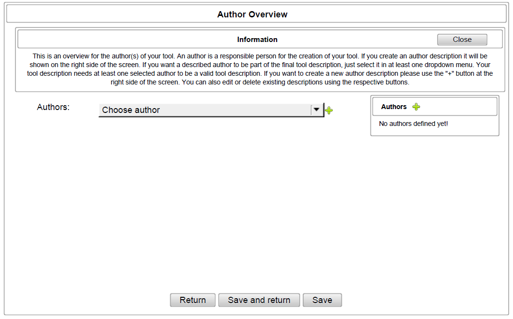

[layout-selectionPage]

##### 

Selection pages have the following visual elements (see figure [layout-selectionPage]).

##### Dropdown section:

On the left side of the screen you can select created elements in a dropdown menu. If you select them there and save your current state of work these elements will be part of the final tool description. This enables you to easily exclude parts of your description from output generation for testing purposes. You can also decide to include an element multiple times in the final tool description.

##### Element list:

On the right side of the screen all elements are shown that may be selected in the dropdown menu.

Edit Pages
----------

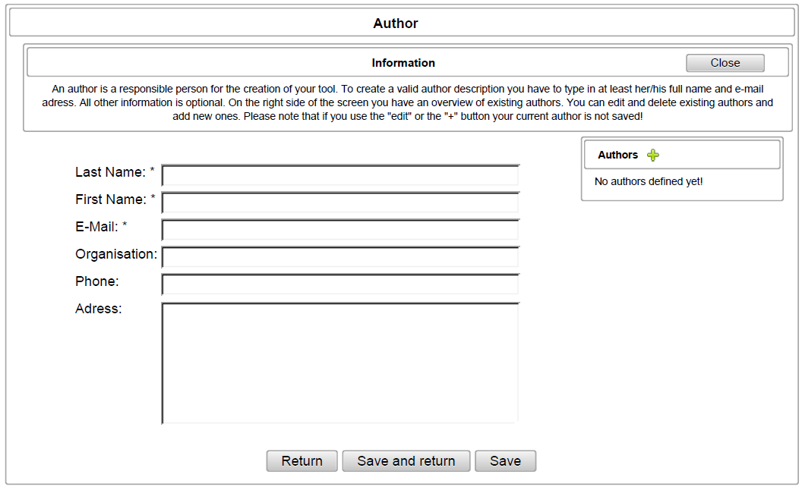

[layout-editPage]

##### 

Edit pages have the following visual elements (see figure [layout-editPage]):

##### Edit section:

On the left side of the screen you can see the main edit section which visualizes all data contained in the current element. You can insert all data for a given element here or access further edit pages/editor pages. Entries markes with a “\*” are mandatory.

##### Element list:

On the right side of the screen all elements that you already created are shown. This does not only include elements of the current type but also all element that are relevant for the current type (for example: functions also contain input objects. Therefore input objects are also shown at the element list of the Function edit page (see also: [function]).

Editor Pages
------------

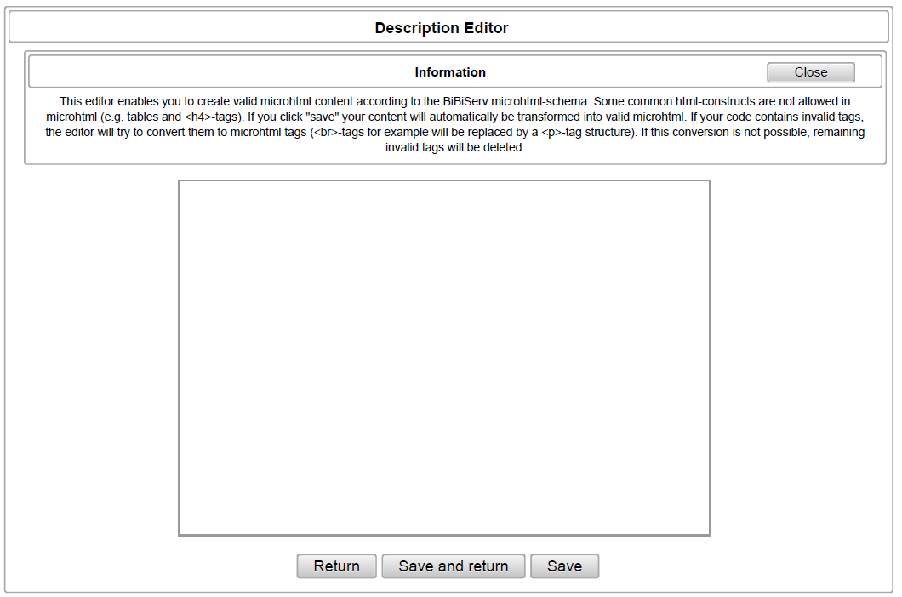

[layout-editorPage]

##### 

Editor pages have the following visual elements (see figure [layout-editorPage]):

##### HTML editor:

At the center of the screen you can see the html rich text editor. If you save your current state of work your html input is validated. Invalid parts of your content are either converted to valid content or removed. You can see the changes done by parsing directly in the editor window. This means that this is a what-you-see-is-what-you-get-editor: The editor window simulates the final output visible for BiBiServ users.

##### 

Editor pages accept either micro- or miniHTML content. You can find more information on this topic in chapter [standards].

Wizard in Detail
================

[sitemap]

##### 

The wizards site structure is similar to the BiBiServAbstraction-schema (see [bibiservabstraction]). The sitemap is visualized in figure [sitemap].

General Tool Description
------------------------

### Overview page

##### 

see also: [layout-overview].

##### Basic Information:

Leads to the basic information page ([basicInfo]).

##### Executable Information:

Leads to the executable information page ([execInfo]).

##### Author Overview:

Leads to the author selection page ([authorSelection]).

##### Function Overview:

Leads to the function selection page ([functionSelection]).

##### Manual:

Leads to the manual edit page ([manual]).

##### Reference Overview:

Leads to the reference selection page ([referenceSelection]).

##### View Overview:

Leads to the view edit page ([view]).

##### File Overview:

Leads to the file selection page ([fileSelection]).

##### Load XML:

Leads to the load XML page ([load-xml]).

##### Create XML:

Leads to the create XML page ([create-xml]).

##### Clear:

Deletes the current content. Before doing that you should save your current working state!

### Basic Information

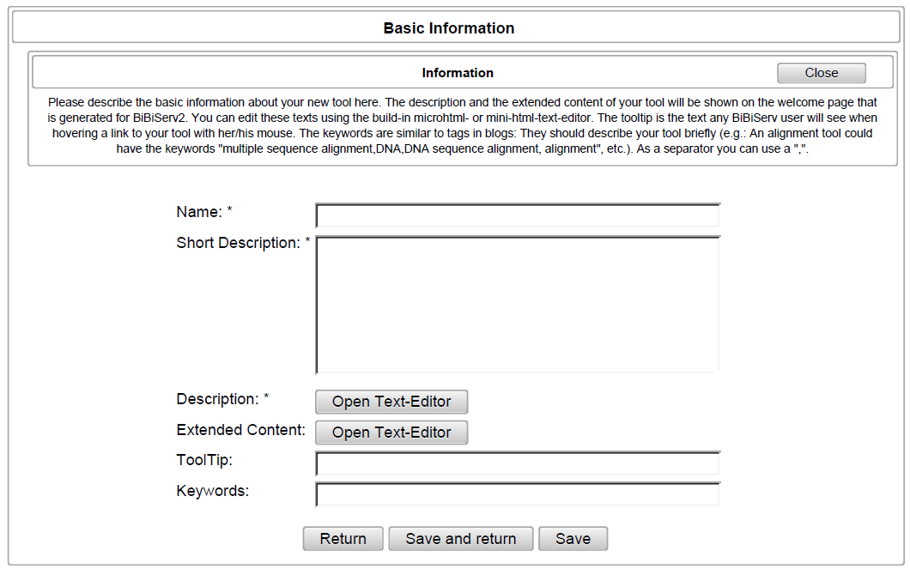

##### 

Please describe the basic information about your new tool here.

##### Name (mandatory):

This is just the name of your tool. It will be displayed on all pages.

##### Description (mandatory):

The description should be a short introduction to your tool. It will be displayed on the welcome page for your tool. You can edit it by clicking on the “Open Text-Editor” button. The editor enables you to insert valid microHTML content (see section [microhtml]). The editor is also described in section [layout-editorPages].

##### ToolTip:

The tooltip is the text any BiBiServ user will see when hovering a link to your tool with her/his mouse. It is in this regard similar to the short description but should be more concise.

##### Keywords:

The keywords are similar to tags in blogs: They should describe your tool briefly (e.g.: An alignment tool could have the keywords “multiple sequence alignment,DNA,DNA sequence alignment,alignment”, etc.). As a separator you can use a “,”.

### Executable Information

##### 

Add information about the execution of your tool here.

##### Executable Type (mandatory):

The executable type describes how your tool will be integrated on the BiBiServ (e.g. as a Java-class or a plain binary).

##### Calling Information (mandatory):

The calling information is the “prefix” of any command line call of your tool without its path (e.g. in the call “myTool -e -f inputfile.fas” where “-e” and “-f” are optional parameters the calling information would be “myTool”).

##### Version (mandatory):

This is just the current version of your tool (per default you should write “1.0” here).

Author Description
------------------

### Author Selection Page

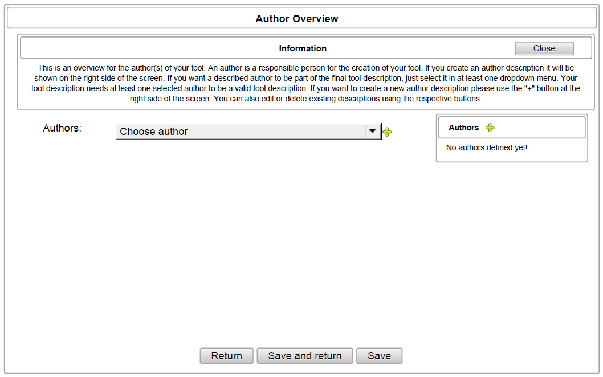

### Author Edit Page

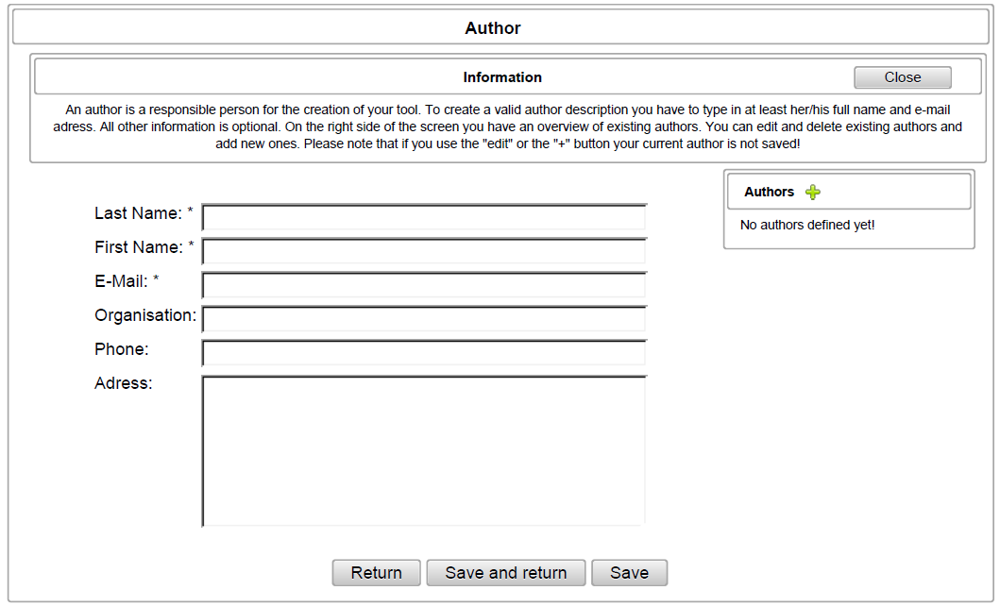

##### 

An author is a responsible person for the creation of your tool. The fields on this page are basically self-explanatory. An example for “Organisation” is “Bielefeld University”. The mandatory fields are “Last Name”, “First Name” and “E-Mail”.

##### 

For at least one author you should provide a valid personal e-mail address. This enables BiBiServ Administrators to contact her/him if there are technical problems with your tool. This e-mail-address will be displayed to BiBiServ users. For all other authors you can insert a general adress like bibi-help@cebitec.uni-bielefeld.de.

Functionality Description
-------------------------

### Function Selection Page

### Function Edit Page

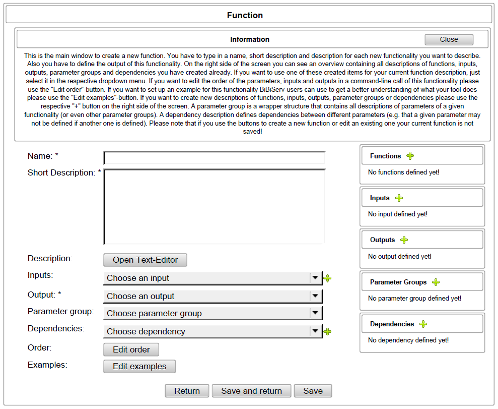

##### 

A function is basically a use case for your tool (e.g. multiple sequence alignment for proteins). If your tool has multiple different application purposes you should create a function for each. If a BiBiServ user clicks on the link to this tools submission page she/he will be able to choose between the different functionalities.

##### Inputs:

An input is a datastructure representing real biological data. This is the input your tool is actually working on. You can select multiple inputs like in a selection page (see section [layout-selectionPages]). It is also possible to define no input at all.

##### Output (mandatory):

The output is a datastructure your tool returns after doing its work. Like an input it is a bioinformatical datastructure. One functionality only has one output. You can select the output in the given dropdown menu.

##### Parameter Group:

A parameter group is a wrapper structure referencing parameters or other parameter groups. A function has always one parameter group. However the concept of a parameter group allows to reference as many parameters as you like inside the parameter group. You can select the parameter group in the given dropdown menu.

##### Dependencies:

Dependencies are constraints for parameters (e.g. one parameter has to be defined if another one is defined). The dependencies are described in Jan Kruegers DependencyLanguage (see section [dependencyLanguage]). You can select multiple dependencies like in a selection page (see section [layout-selectionPages]). It is also possible to define no dependency at all.

##### Order:

Leads to the order edit page ([order]).

##### Example:

Leads to the example edit page ([example]). An example is a set of values for the inputs and parameters of this functionality to show the user how to use it.

### Input Edit Page

##### 

An input is a datastructure representing real biological data. This is the input your tool is actually working on. Each input is shown with an own input window at the submission page of this functionality. The input will be automatically validated and converted according to the representation you choose (see below).

##### Representation (mandatory):

This is the bioinformatics data format your tool accepts as input. Users of the BiBiServ2 will not only be able to use this specific representation but also any other one that can be converted into input for this tool (see section [representations]). Therefore you should add any specific information about the specific representation to your inputs description texts (see above). The build-in filters should make it easy to find the right representation for your input. If you are not able to find the right one, please select “ToolDependentRepresentation”.

##### Handling (mandatory):

This defines how your tool would like to get input. This is a purely technical information and is transparent to the BiBiServ user. If you select “FILE” the filename will be inserted into a command line call of your tool. If you select ”STDIN“ the data will be forwarded using pipes. ”ARGUMENT“ file handling means the user input will be provided as a commandline argument. ”NONE\`\` should only be selected by advanced users: You’ll have to program the input handling yourself in the generated classes in the output project (see section [codegen]).

##### Option:

This is a commandline prefix for your input data. This is a purely technical information and is transparent to the BiBiServ user. If your tool needs to have a “ -i ” before the input data starts you can write “ -i ” here.

##### Example:

You can directly provide an example for your input data here by either uploading it or pasting it into the given text area. BiBiServ users will be able to select an example to see how your tool works. Therefore we strongly recommend providing example data. For more details on examples please see section [example].

### Output Edit Page

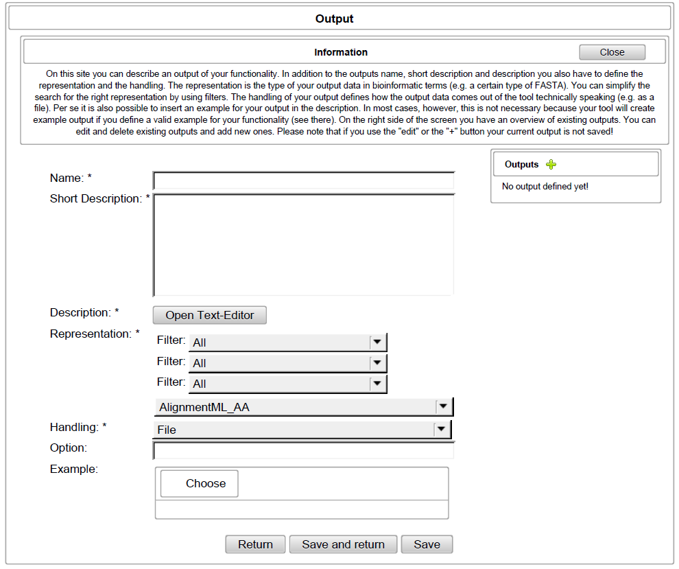

##### 

The output is a datastructure your tool returns after doing its work. The output will be shown either directly or in converted form to a BiBiServ user after a submission is finished. It depends on the representation you choose how the output is visualized (see below).

##### Representation (mandatory):

This is the bioinformatics data format your tool returns as output. Users of the BiBiServ2 will not only be able to use this specific representation but also any other one that can be converted from output returned by this tool (see section [representations]). Therefore you should add any specific information about the specific representation to your outputs description texts (see above). The build-in filters should make it easy to find the right representation for your output. If you are not able to find the right one, please select “ToolDependentRepresentation”.

##### Handling (mandatory):

This defines how your tool returns the output. This is a purely technical information and is transparent to the BiBiServ user. If you select “FILE” an output file name will be added to the command line call. If you select “STDOUT” the output data will be read from the System.out-Stream.

##### Option:

This is a commandline prefix for your output data. This is a purely technical information and is transparent to the BiBiServ user. If your tool needs to have a “ -o ” before the output file name starts you can write “ -o ” here.

##### Example:

You can directly provide an example for your output data here by either uploading it or pasting it into the given text area. In most cases, however, this is not necessary because your tool will create example output if you define a valid example for your functionality. For more details on examples please see section [example].

### Parameter Groups Edit Page

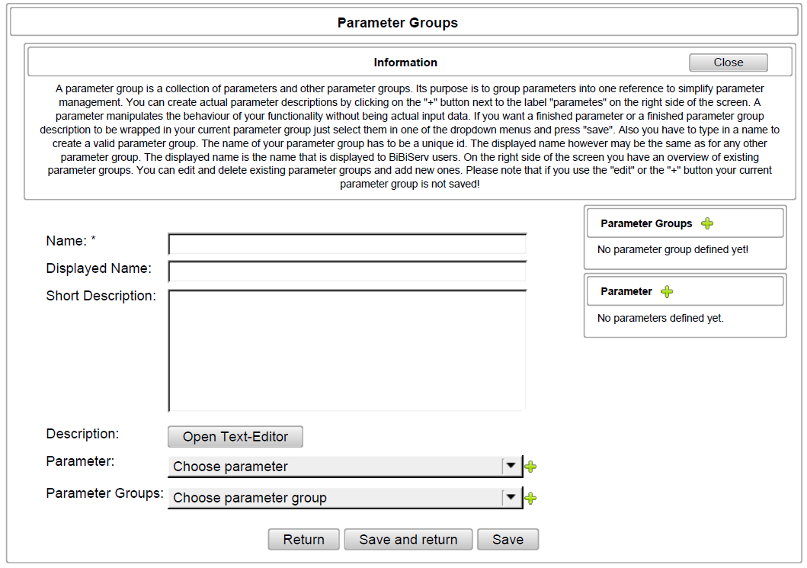

##### 

A parameter group is a wrapper structure referencing parameters or other parameter groups. Its purpose is to group parameters into one reference to simplify parameter management. If you only have one parameter group for each functionality they are not shown to the BiBiServ user. If you have more than one parameters are grouped together according to their parameter group at the submission page of the respective functionality as well as at the manual page.

##### Name (mandatory):

This is the internal id of the parameter group. This id is hidden from the user and thus does not have to be human readable. It must not be ambigous though.

##### Displayed Name:

Per default parameter groups are transparent to the BiBiServ user. If you want that a parameter group is shown in the manual and the submission page of your tool you should add a displayed name.

##### Parameter (mandatory if no Parameter Group is selected):

A parameter manipulates the behaviour of your functionality without being actual input data. You can select multiple parameters like in a selection page (see section [layout-selectionPages]).

##### Parameter Groups (mandatory if no Parameter is selected):

Other parameter groups that are wrapped into this one. You can select multiple parameter groups like in a selection page (see section [layout-selectionPages]).

### Parameter Edit Page

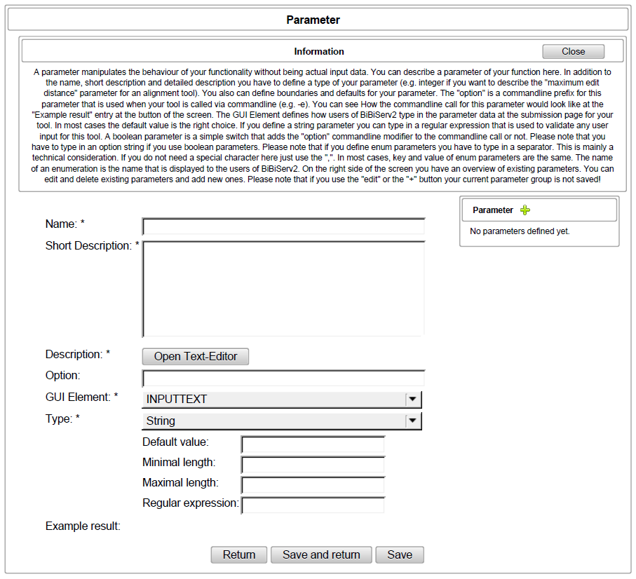

##### 

A parameter manipulates the behaviour of your functionality without being actual input data. Parameters will be shown to the user at the submission page of this functionality after providing input. How they are visualized depends on the type and the GUI element (see below).

##### Option (mandatory if type is boolean):

This is a commandline prefix for your parameter. E.g. if your tool needs a “ -p ” before the parameter value begins you can write “ -p ” here. At the bottom of the screen there is a preview of the resulting commandline call.

##### GUI Element (mandatory):

This defines which GUI element is displayed to a BiBiServ user for this parameter at the submission form of your tool on the BiBiServ. You should decide about the type of your parameter before editing the GUI element because the type manipulates which GUI elements can be selected.

##### Type (mandatory):

The type defines what kind of parameter a BiBiServ user can manipulate to change your tools behaviour. Your choice here manipulates the rest of the description:

-   **String**

    -   **Default value:** If a BiBiServ user does provide input for this parameter at the submission form this default value is used.

    -   **Minimal length:** A plain integer that defines the minimal length of user input for this parameter.

    -   **Maximal length:** A plain integer that defines the maximal length of user input for this parameter.

    -   **Regular Expression:** A regular expression used to validate user input for this parameter. Input of a BiBiServ user that can not be matched by this regular expression will lead to an error message at runtime.

-   **Int**

    -   **Default value:** If a BiBiServ user does provide input for this parameter at the submission form this default value is used.

    -   **Minimum value:** A plain integer that defines the minimum value of this integer.

    -   **Minimum included:** If activated the user can use the minimum value. If not the user can only use values larger than the minimum value.

    -   **Maximum value:** A plain integer that defines the maximum value of this integer.

    -   **Maximum included:** If activated the user can use the maximum value. If not the user can only use values smaller than the minimum value.

-   **Float**

    -   **Default value:** If a BiBiServ user does provide input for this parameter at the submission form this default value is used.

    -   **Minimum value:** A float value that defines the minimum value of this float.

    -   **Minimum included:** If activated the user can use the minimum value. If not the user can only use values larger than the minimum value.

    -   **Maximum value:** A float value that defines the maximum value of this float.

    -   **Maximum included:** If activated the user can use the maximum value. If not the user can only use values smaller than the minimum value.

-   **Boolean** A boolean parameter does not transfer the given value by the user to the command line call. Instead it is a switch of the commandline modifier given in the “Option” text field above: if the user clicks “true” the modifier is written to the commandline call. If not, it is not written to the command line call. Therefore you have to provide an “Option” value if you are using boolean parameters.

    -   **Default value:** If a BiBiServ user does provide input for this parameter at the submission form this default value is used.

-   **DateTime**

    -   **Default value:** If a BiBiServ user does provide input for this parameter at the submission form this default value is used.A DateTime value is validated using a DateTime regular expression.

-   **Enum** An enum parameter is the most flexible type of parameter. A BiBiServ user has the choice between different values. If she/he chooses one the internal value of this enum instance is written to the command line. However this internal process is transparent to the user. E.g. if you use large matrices as parameter for your tool you can just show the user the names of those matrices while the management of the matrix itself happens internally.

    -   **Enum type:** Type of each enum instance.

    -   **Prefix:** The prefix that is written to the command line before the actual enum instance value.

    -   **Suffix:** The suffix that is written to the command line after the actual enum instance value.

    -   **Separator (mandatory):** The separator between enum instances. This is a purely technical value and is transparent to the BiBiServ user. Per default you should just enter “,” here.

    -   **Minimum Selection:** The smallest possible amount of instances a BiBiServ user may select at this parameter.

    -   **Maximum Selection:** The largest possible amount of instances a BiBiServ user may select at this parameter.

    -   **Enumerations:**

        -   **Name:** This is the name displayed to BiBiServ users of this enumeration instance.

        -   **Key:** This is the internal id identifying this enumeration instance. This is hidden from BiBiServ users.

        -   **Value:** This is the actual value of this enum instance written to the command line if the user selects it.

        -   **Default value:** If the user does not select a value, this one is used. You may only select one default value.

##### Example result:

Preview of a command line call for this parameter.

### Dependency Edit Page

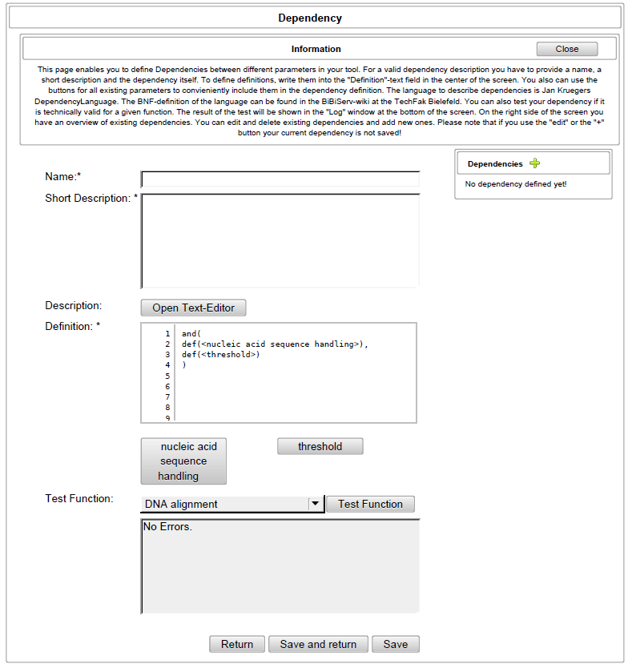

##### 

This page enables you to define Dependencies between different parameters in your tool. Dependencies are constraints for parameters (e.g. one parameter has to be defined if another one is defined). The dependencies are described in Jan Kruegers DependencyLanguage (see section [dependencyLanguage]). Dependencies are not directly shown to the BiBiServ user at the submission page, they are just used to validate her/his input. Every dependencies description text is displayed at the manual page though.

##### Definition (mandatory):

The definition of a dependency is the actual description of the dependency itself. It is written in Jan Kruegers DependencyLanguarge (see section [dependencyLanguage]). Beneath the text area there is a board with parameters that can be referenced. Just click one of those buttons to insert the parameter reference in the definition text area.

##### Test function:

If you want to know if a given function with its examples and default values satisfies your current dependency you can test it here by selecting the function in the dropdown menu and clicking the “Test function” button. The text area beneath will show the tests result.

### Order Edit Page

##### 

You can edit the order of the arguments in an command line call of this functionality here.

##### 

The order is not shown to the BiBiServ user. You won’t even need to edit it if your tool does not depend on a specific order of arguments (parameters + inputs + output). However if your functionality does need a specific order (e.g. all parameters have to be used before the input) you can sort the arguments here using the arrow buttons.

##### 

At the bottom of the page you can see a preview of the resulting command line call. Please note that per default whitespaces between arguments are included in a command line call. If this functionality depends on a certain order of arguments please edit the order using the arrow buttons.

##### 

You can also insert additional strings for calling the tool (like whitespaces) using the “+” button.

### Example Edit Page

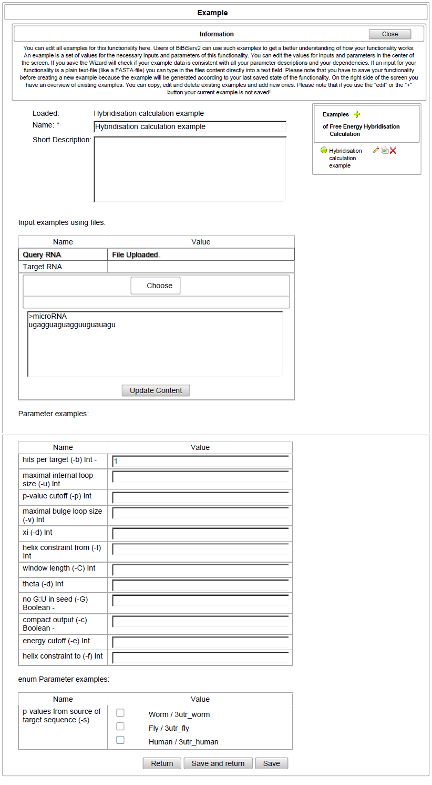

##### 

An example is a set of values for the inputs and parameters of this functionality to show the user how to use it. The examples will be displayed at the submission page of your tool. Users can click an example button that activates a given example.

##### Input examples using files:

You can upload example input for the inputs of your function that have file handling here. If you already did upload an example at the respective Input Edit Page (see section [inputs]) this will be displayed here. You can also directly manipulate the file content by using the text area beneath the uploader.

##### Input examples using strings:

You can type in example input for the inputs of your function that have string handling here using the text area. If you already did provide an example at the respective Input Edit Page (see section [inputs]) this will be displayed here.

##### Parameter examples:

This is a list of all parameters of this function. You can provide input for each of them in the text field beside it. If your parameter data does not satisfy the dependencies you selected for this function an error message will be displayed (see [dependency] and [dependencyLanguage]).

##### enum Parameter examples:

This is a list of all enumeration parameters of this functions. You can choose which enumeration instances shall be activated here. If your parameter data does not satisfy the dependencies you selected for this function an error message will be displayed (see [dependency] and [dependencyLanguage]).

Manual Edit Page
----------------

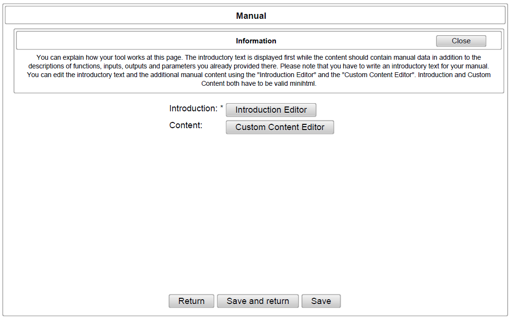

##### 

The largest part of your manual will be autogenerated using the descriptions your provided for functionalities, parameters, inputs and so on. This site enables you to add additional data to the manual.

Supplementary Information
-------------------------

### Reference Selection Page

### Reference Edit Page

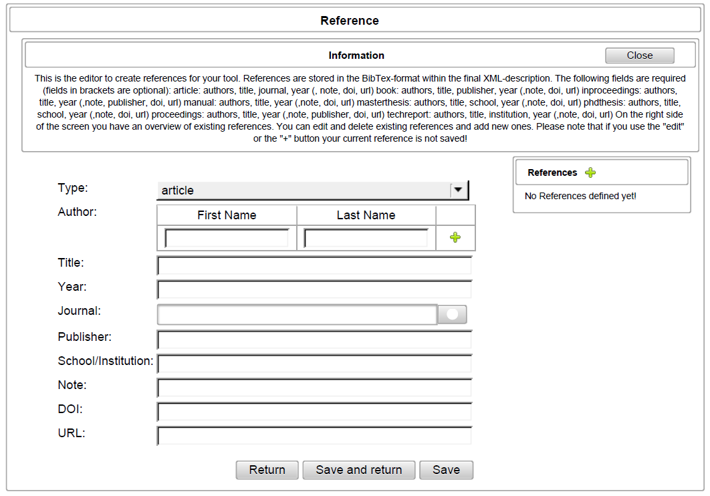

##### 

A reference is described here according to the BibTex standard. The entries are pretty self-explanatory. The URL should be a link to the reference and the DOI is the “digital object identifier” of your reference. In the BibTex-section ([bibTex]) we discuss in detail, which fields are mandatory for which BibTex-type.

##### 

References are shown to the user on an extra page calles “references”. The first reference you provide is shown on the welcome page for your tool with a plea to reference it if your tool is used. Thus the first reference you create should be your own thesis/article on the tool.

##### 

Please note: A reference is identified by the first three letters of the author(s) name(s) and the year. You can not save multiple reference with the exact same author(s) and year of publishing.

### View Edit Page

##### 

A view is an additional HTML page for your tools site on the BiBiServ.

##### 

You have the choice between different types of additional pages that are contained in the BiBiServAbstraction schema (see section [bibiservabstraction]). Please note that you can only create view for each type. Saving multiple views with the same type will result in an error message.

##### Title:

The title of your page. If you don’t enter a title it will be auto-generated.

##### View Type:

There are several different types of views defined in the BiBiServAbstraction schema. They define different types of pages that have been part of BiBiServ tool web interfaces over the years (as “submission” page “download” page and so on). If you want to add a page that is not part of this list you have to do it manually after calling codegen (see section [create-xml] and [codegen]).

### File Selection Page

### File Edit Page

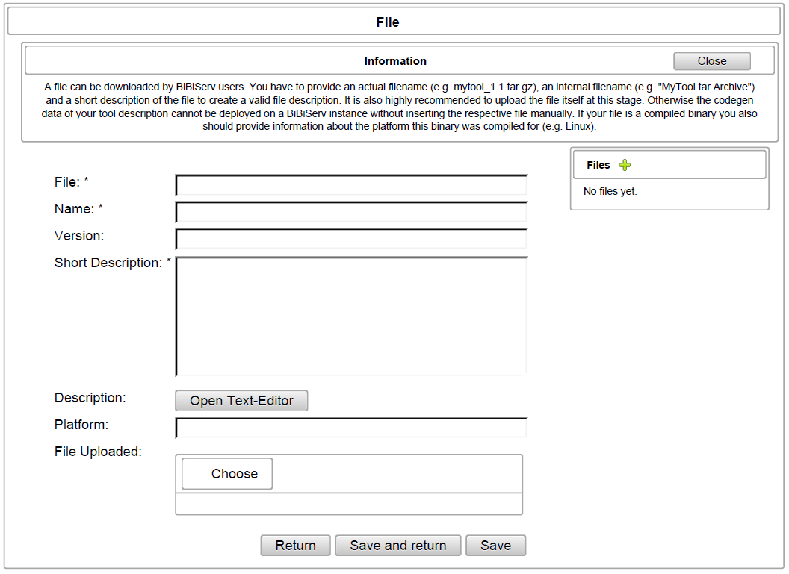

##### 

A file can be downloaded by BiBiServ users. These files are shown on an extra page called “Downloads”.

##### File (mandatory):

This is the actual file name. It will be changed according to your upload. If you don’t directly upload the file to the wizard (see below) you have to add the file to your tool project after using codegen (see section [create-xml] and [codegen]) and before deploying it on the BiBiServ (see also section [downloadables]).

##### Version:

If you add a binary of your file here you should include its version.

##### Platform:

If you add a file that only works on certain platforms (like compiled binaries) you should include that information here.

##### File uploaded:

You can upload the file itself here. The file name (see above) will change accordingly.

### Image File Edit Page

##### 

You can upload image files here. Image files are not part of the tool description itself but will be stored in an image folder on the server and inserted into the codegen directories if you use codegen (see section [create-xml] and [codegen]). An image file has the sole purpose of being referenced by the html-pages generated for this tool description and it is not shown to a BiBiServ user if you don’t reference it in an \-tag somewhere in your tool description.

##### File Name (mandatory):

The actual file name on the server. It will be changed according to your upload.

##### File uploaded:

You can upload the file itself here. The file name (see above) will change accordingly.

Import and Export
-----------------

### Load XML

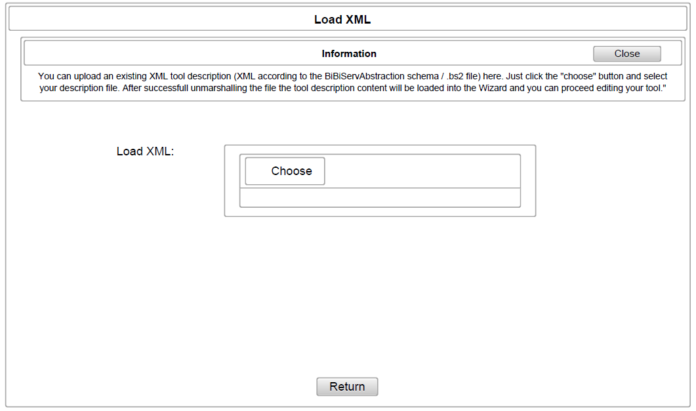

##### 

You can upload an existing XML tool description here (XML according to the BiBiServAbstraction schema / .bs2 file; see section [bibiservabstraction] and [bs2]). Just click the “choose” button and select your description file.

##### 

After unmarshalling the tool description content will be loaded into the Wizard and you can proceed editing your tool.

##### Return:

Leads back to [overview].

### Create XML

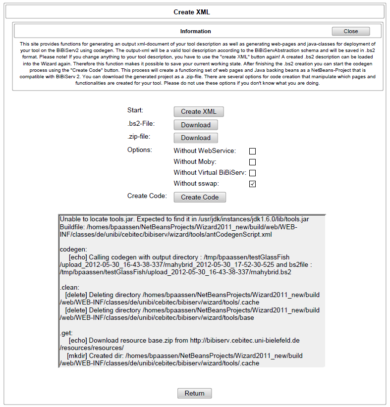

##### 

This site provides functions for generating output for your tool (see also chapter [output]).

##### Create XML:

This button will start the xml generation (see section [bs2]). After successfully generating a .bs2 file for your tool according to the BiBiServ abstraction schema (see section [bibiservabstraction]) you can download it by clicking “Download” next to the “.bs2-file” label. Please note that changes to your tool description are automatically transfered to the .bs2. Every time you made changes you have to use the “Create XML” button again. This is a way to save a copy of your current working state as a file. You can load it back into the wizard later by using the load xml functionality (see [load-xml]).

##### Options:

This is only displayed after finishing xml creation once. These are your options to manipulate the codegen process. This is explained in detail in section [codegen]. If you are new to the wizard you probably should not use these options.

##### Create Code:

This button starts the codegen process. It creates a full-blown project directory for your tools web interface including HTML pages and Java Beans that can be directly deployed onto the BiBiServ (see section [instantbibi]). The large text box beneath will show you the current state of the codegen process. This might take several minutes to finish.

##### 

You can download the finished project by clicking on the “Download” button next to the “.zip-file” label.

##### Return:

Leads back to [overview].

Formats and Standards
=====================

##### 

In this chapter we will discuss several different standards and formats that are used in the Wizard. If you generate a tool description using the Wizard your description will automatically satisfy all of these standards. Therefore this chapter is designated for advanced users that want to have a more thorough understanding of the Wizard.

BiBiServ Abstraction Schema
---------------------------

##### 

The BiBiServ abstraction schema was developed by Daniel Hagemeier for his master thesis[2]. It is an xml schema (.xsd) that is meant to be an interface for xml tool descriptions for the BiBiServ2. The BiBiServ code generation tools (see [create-xml] and [output]) will use the properties defined in the schema to generate a full blown project folder that can be deployed on BiBiServ2. This is a huge improvement for developers and administrators: Both just have to program against the interface (BiBiServ abstraction schema). Developers don’t have to know the BiBiServ2 server structure and administrators don’t need to know how the tools work exactly.

##### 

If you generate an output xml with this Wizard it will automatically be a valid xml document according to this schema. If you are interested in the details you can have alook at the schema directly[3].

BiBiServ Ontology Representations
---------------------------------

##### 

A representation is a bioinformatics dataformat that represents any kind of biological data. Because there are lots of different dataformats for the same biological data bioinformatics users often have to implement converters to use a tool that relies on another kind of representation for the same data.

##### 

The BiBiServ Ontology by Sven Hartmeier[4] recognizes this fact and serves as an interface between tools, converters and visualizers. By providing a representation of your tools input and output you enable the ontology to find a converter in the BiBiServ libraries from your representation to the one the BiBiServ user needs or even a converter chain that enables your tool to understand the user input.

##### 

Utilizing this ontoogy BiBiServ users can not only use the native representation of your tool but also every representation that can be converted from or to your tools native ones. Ideally it should be possible for BiBiServ users to insert any kind of representation and your tool will understand it as long as the biological data that is modelled makes sense.

### Three axis principle

##### 

Representations are classified in three different categories:

##### Content:

The content of a representation is the actual biological data it models. This could be Amino Acid data or more specific contents like Ribonucleic acids.

##### Datastructure:

The datastructure is the structural form of the biological data a given representation models. Examples would be plain sequence data, alignment data, structure data (like secondary structures) and so on.

##### Format:

This is the specific bioinformatics format family this representation belongs to, for example FASTA, GDE or Alignment-ML.

### Filters

##### 

Inside the wizard these axis are represented by filters that help you to choose the right representation for your tools input or output (see section [inputs] and [outputs]).

MicroHTML
---------

### MicroHTML Editor

### MicroHTML tags

##### 

The following tags are available in MicroHTML:

##### 

lX **tag** & **description**
\<a\>& Tag for starting a link. Allowed attributes are: href, hreflang and name
[0.1cm] \<cite\> & Tag for starting a quote.
[0.1cm] \<q\> & Tag for starting an inline quote.
[0.1cm] \<em\> & Tag for starting emphasized text (italic text format). i- und u-tags are allowed in MicroHTML. They are replaced by em-tags.
[0.1cm] \<strong\> & Tag for starting strong text (bold text format). b-tags are allowed in MicroHTML. They are replaced by strong-tags.
[0.1cm] \<sample\> & Tag for starting a sample.
[0.1cm] \<sub\> & Tag for starting subscript text.
[0.1cm] \<sup\> & Tag for starting superscript text.
[0.1cm] \ & Image-tag. Allowed attributes are: src, alt, name and longdesc. Please note that src and alt are attributes. If you want to include an image the smartest way of doing to is to reference the picture manually with the relative path resources/images/mypicture.png and uploading the image itself as an ImageFile (see section [imageFile])
[0.1cm] \<ol\> & Tag for starting an ordered list. This tag may only contain li-tags.
[0.1cm] \<ul\> & Tag for starting an unordered list. This tag may only contain li-tags.
[0.1cm] \<li\> & Tag for a list entry. Is only allowed if included in a ol- or ul- tag. The only allowed attribute is value.
[0.1cm] \<br/\> & Tag for a line break. If you type in this tag directly it will be replaced by a paragraph structure (p-tags) because that is what you’ll want normally. If you really need line breaks you can force a br-tag by including a \<`!--` br`--`\> comment tag in the source code.
[0.1cm] \<p\> & Tag for starting a new paragraph.
[0.1cm] \<hr/\> & Tag for a vertical line. If you type in this tag directly will be deleted. If you really need it you can force a hr-tag by including a \<`!--` hr`--`\> comment tag in the source code.
[0.1cm]

MiniHTML
--------

### MiniHTML Editor

### MiniHTML tags

##### 

In addition to the MicroHTML tags the following tags are available in MiniHTML:

##### 

lX **tag** & **description**
\<table\>& Tag for starting a table. This tag may only contain caption-. tfoot-, thead-, tbody- or tr-tags. The only allowed attribute is summary.
[0.1cm] \<caption\> & Tag for starting table caption.
[0.1cm] \<thead\> & Tag for starting the head section of a table. This tag may only contain tr-tags.
[0.1cm] \<tfoot\> & Tag for starting the foot section of a table. This tag may only contain tr-tags.
[0.1cm] \<tbody\> & Tag for starting the main content section of a table. This tag may only contain tr-tags.
[0.1cm] \<tr\> & Tag for starting a table row. This may only contain td- or th-tags.
[0.1cm] \<td\> & Tag for starting a cell in a table. Allowed attributes are abbr, axis, headers, scope, rowspan, colspan and nowrap.
[0.1cm] \<th\> & Tag for starting a header cell in a table. Allowed attributes are abbr, axis, headers, scope, rowspan, colspan and nowrap.
[0.1cm] \<h4\> & Tag for starting a heading.
[0.1cm] \<h5\> & Tag for starting a heading (smaller than h4).
[0.1cm] \<h6\> & Tag for starting a heading (smaller than h5).
[0.1cm]

BibTex
------

##### 

BibTex is a format to describe references. It is described in detail on the BibTex-homepage[5].

##### 

Each reference has a certain type (see below). The following fields are required and optional for each type:

##### 

llX **Type** & **Required** & **Optional**
[0.1cm] article & authors, title, journal, year & note, doi, url
[0.1cm] book & authors, title, publisher, year & note, doi, url
[0.1cm] inproceedings & authors, title, year & note, publisher, doi, url
[0.1cm] manual & authors, title, year & note, doi, url
[0.1cm] masterthesis & authors, title, school, year & note, doi, url
[0.1cm] phdthesis & authors, title, school, year & note, doi, url
[0.1cm] proceedings & authors, title, year & note, publisher, doi, url
[0.1cm] techreport & authors, title, institution, year & note, doi, url
[0.1cm]

Dependency Language
-------------------

##### 

The BiBiServ Dependency Language was developed by Jan Krueger to have a common formal description for dependencies between parameters in BiBiServ tools. A typical example for such a dependency is that one parameter has to be defined if another one is defined and may not be defined if the other one is not defined. This is - in terms of formal logic - the equivalence of two parameters. In Jan Kruegers DependencyLanguage this would be described as

     or(
       and(
         def(parameter A),
         def(parameter B)
       ),
       and(
         not(def(parameter A)),
         not(def(parameter B))
       )
     )

##### 

You can find a detailed description in the TechFak wiki[6].

### BNF definition

##### 

The Backus Naur-Form of the Dependency-Language is:

##### 

lcX \<Function\> (root Element) & ::= & \<AND\> \(\vert\) \<OR\> \(\vert\) \<XOR\>\(\vert\) \<NOT\> \(\vert\) \<IMPL\> \(\vert\) \<LOGEQ\> \(\vert\) def(\<id\>) \(\vert\) \<EQUALS\> \(\vert\) \<GREATER\> \(\vert\) \<GREATEREQUALS\> \(\vert\) \<LESSER\> \(\vert\) \<LESSEREQUALS\>
[0.1cm]

\<AND\> & ::= & and(\<Function\>,\<Function\>)
[0.1cm]

\<OR\> & ::= & or(\<Function\>,\<Function\>)
[0.1cm]

\<XOR\> & ::= & xor(\<Function\>,\<Function\>)
[0.1cm]

\<NOT\> & ::= & not(\<Function\>)
[0.1cm]

\<IMPL\> & ::= & impl(\<Function\>,\<Function\>)
[0.1cm]

\<LOGEQ\> & ::= & logeq(\<Function\>,\<Function\>)
[0.1cm]

\<EQUALS\> & ::= & eq(\<id\>,\<id\> \(\vert\) \<value\>)
[0.1cm]

\<GREATER\> & ::= & gt(\<id\>,\<id\> \(\vert\)\<value\>)
[0.1cm]

\<GREATEREQUALS\>& ::= & ge(\<id\>,\<id\> \(\vert\)\<value\>)
[0.1cm]

\<LESSER\> & ::= & lt(\<id\>,\<id\> \(\vert\)\<value\>)
[0.1cm]

\<LESSEREQUALS\> & ::= & le(\<id\>,\<id\> \(\vert\)\<value\>)
[0.1cm]

\<id\> & ::= & @[A-Z,a-z,0-9]+
[0.1cm]

\<value\> & ::= & [0-9]+[.]?[0-9]\*\(\vert\)[A-Z,a-z,0-9,...]
[0.1cm]

Output
======

##### 

In this chapter the Wizards output is described in detail. The Wizards createXML page (see section [create-xml]) enables you to generate a xml tool description file (section [bs2]) as well as a full-blown netbeans project (section [codegen]) that can be deployed on the BiBiServ (section [instantbibi]).

XML Tool Description
--------------------

##### 

The first output format is a .bs2-file for your tool. “.bs2” means “BiBiServ2” and indicates that this xml file satisfies all necessary standards (see chapter [standards]) for using it in the BiBiServ 2 system. This file is plain xml and can be opened in any text editor. You can also use this file to save your current state of work and load it back into the wizard later because it will contain any saved information (see section [load-xml]; please note: Created functions, authors, outputs, inputs, parameters, etc. which are not selected in the respective dropdown menus are saved; also image Files are not saved).

##### 

.bs2 files are the basis for BiBiServ code generation using base and codegen (see section [codegen]).

Codegen Output
--------------

##### 

As soon as you generated a valid xml using the Wizard you can start the code generation process (see section [create-xml]). If you do so the Wizard calls sub-programs called “base” and “codegen”. These will generate an HTML frontend in the BiBiServ2 design as well as backend java bean classes to transform user input to a valid input for your tool and your tools output to displayable content for the HTML pages. In fact a full-blown netbeans project will be generated.

##### 

This process will also copy all image files you have inserted (see section [imageFile]) to the path “resources/images” and all downloadable files (see section [file] and [downloadables]) to the path “resources/downloads” of the output project.

##### 

You can download the finished project as a .zip file.

### Codegen Output Options

##### 

There are several options for codegen that manipulate the programs behaviour.

##### 

lX **Option** & **Description**
withoutWS & If activated codegen will **not** generate a WebService Interface for your tool. Only a regular submission page will be generated.
[0.1cm] withoutMoby & If activated codegen will **not** generate a BioMoby Interface for your tool.
[0.1cm] withoutVB & If activated codegen will **not** generate a VirtualBiBiServ Interface for your tool.
[0.1cm] withoutSSWAP & If activated codegen will **not** generate a Simple Semantic Web Architecture and Protocol (SSWAP) description for your tool.
[0.1cm]

Deployment on BiBiServ
----------------------

##### 

If you want to test what your tools user interface will look like on the BiBiServ, you can set up an instantbibi-instace (this is not documented here, please ask the BiBiServ administration for detailed information on this topic) and deploy the Wizard generated project there.

##### 

Just unzip the project folder (see section [codegen]) and run the command “ant deploy” on the commandline in your project folder after setting up instantbibi. Your tool interface will be deployed and can now be seen at the url `http://localhost:<bibiservport>/<toolname>`.

Downloadable Files
------------------

##### 

Downloadable files like binary distributions of your tool will be referenced in the xml tool description. Therefore the output project will generate a download page for them. If you forget to upload the actual file while using the wizard you have to include it in the “resources/downloads” folder of your finished project (see section [codegen]). Otherwise you won’t be able to deploy your tool (see section [instantbibi]).

Wizard Administration
=====================

##### 

This chapter contains information for administrators of the Wizard. We discuss necessary temporary directories the Wizard will use (see section [temp]) as well as dependencies (see section [wizard-dependencies]).

Temporary Directories
---------------------

##### 

The wizard has two different temporal storage locations. One for each session and a general, short-term one.

### Primefaces short term upload storage

##### 

The Wizard uses primefaces fileUpload-tags that stores uploaded files either in working memory or at hard disk until the fileUploadEvent is handled by the java-backing-beans.

##### 

Files that are smaller than 51,2 Kilobytes are stored in working memory. Larger files are stored in “/tmp/wizard2011/”. Primefaces will automatically generate an unambigous name for each file that does not correspond with the actual filename. Because these uploads are only stored until the Wizards Java beans handled the respective events these files can be deleted regularly. Administrators could use a CronJob for that.

##### 

If you want to change the temporary directories path you have to change the entry

    private static final String primefacesUploadTmpDir = "/tmp/wizard2011";

in the FileUploadIDGenerator.java as well as the entry

    <init-param>
           <!-- This entry defines where uploaded files
           that are larger than 51,2 kb are stored.-->
           <param-name>uploadDirectory</param-name>
           <param-value>/tmp/wizard2011/</param-value>
    </init-param>

in the web.xml.

### Session based temporary file storage

##### 

The Wizard itself uses a file management system based on sessions and timestamps. For each session of each user a temporary directory is created to store all necessary files. The name of the directory is “upload\_” plus a timestamp (precise to the millisecond). If the user starts a new session (by loading an existing xml [see section [load-xml]] or clearing all current data) new temporary directories are created.

##### 

if the user uploads downloadable files they are stored in the “resources/downloads” subdirectory. Image Files are stored in “resources/images”. An output .bs2 description is stored in the main folder as well as the created tool project and its zipped version.

##### 

These temporary folders are deleted by the wizard. To delete them is a task for the administration (e.g. CronJob).

##### 

If you want to change the temporary directories path you have to change the entry

    private static final String baseUploadDirectoryPath = "";

in the FileUploadIDGenerator.java.

Dependencies
------------

##### 

Most of the dependencies are stored in the ivy.xml. The following table shows which dependency is used for what purpose.

lX **Dependency** & **Description**
[0.1cm] BiBiServAbstraction & Contains jaxb-classes for building a bs2-tool-description. Is used primarily in builder-classes, CreateXML.java and LoadXML.java.
[0.1cm] Base & Is not part of the ivy-file. Base is downloaded (including codegen) in the antCodegenScript.xml on demand. Base is used to generate a deployable output project (see section [codegen]).
[0.1cm] Codegen & see above
[0.1cm] OntoAccess & The API for Sven Hartmeiers Ontology. OntoAccess is called for accessing bioinformatic representations and filtering them (see section [representations])
[0.1cm] unserhtml & Contains MicroHTML and MiniHTML jaxb classes for descriptions and custom content (see section [microhtml] and [minihtml]).
[0.1cm] primefaces & Main visualizing package for wizard frontend.
[0.1cm] Saxon & XSLT-engine to do MicroHTML and MiniHTML conversions.
[0.1cm] DependencyParser & Validates Dependency descriptions (see section [dependency] and [dependencyLanguage])
[0.1cm] commons-io & Dependency of primefaces fileUpload
[0.1cm] commons-fileupload & Dependency of primefaces fileUpload
[0.1cm] commons-codec & Dependency of primefaces fileUpload
[0.1cm]

[1] Mersch, 2004

[2] Hagemeier, 2008

[3] .xsd-schema-location: <http://bibiserv.techfak.uni-bielefeld.de/xsd/bibiserv2/BiBiServAbstraction.xsd>

[4] Hartmeier, 2012

[5] <http://www.bibtex.org/>

[6] <http://wiki.techfak.uni-bielefeld.de/bibiserv/BiBiServ_V2_XMLSServerDescription> (german)

